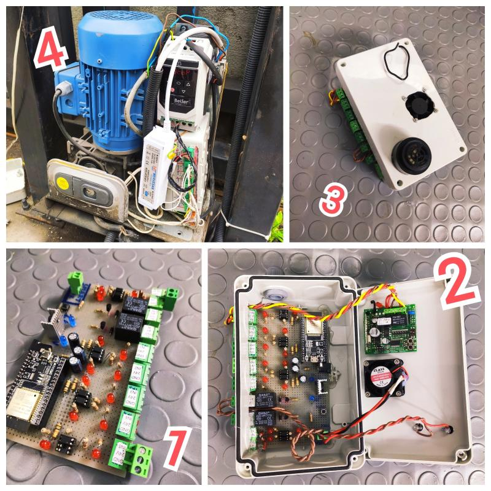

https://lnkd.in/dKH9nJQ3

Fabrikamızın otomatik ana giriş kapısının elektronik kartı yanmasının ardından akıllı bir cihaz ile kontrol etme fikri bizi heyecanlandırdi. ardından çalışmalara başladık ve mevcut sistemle entegre çalışabilecek akıllı yazılıma sahip bir kart gelistirip ürettik. Ardından kapı sistemine montajını gerçekleştirdik ve birkaç yazılımsal kalibrasyon ardından kendi fabrikamızda kullanılan bir son kullanıcı ürünü üretmiş olduk.

After the electronic card of our factory's automatic main entrance door burned out, we were excited about the idea of ​​controlling it with a smart device. Then we started working and developed and produced a card with smart software that could work integrated with the existing system. Then, we installed it on the door system and after a few software calibrations, we produced an end-user product that is used in our own factory. 

